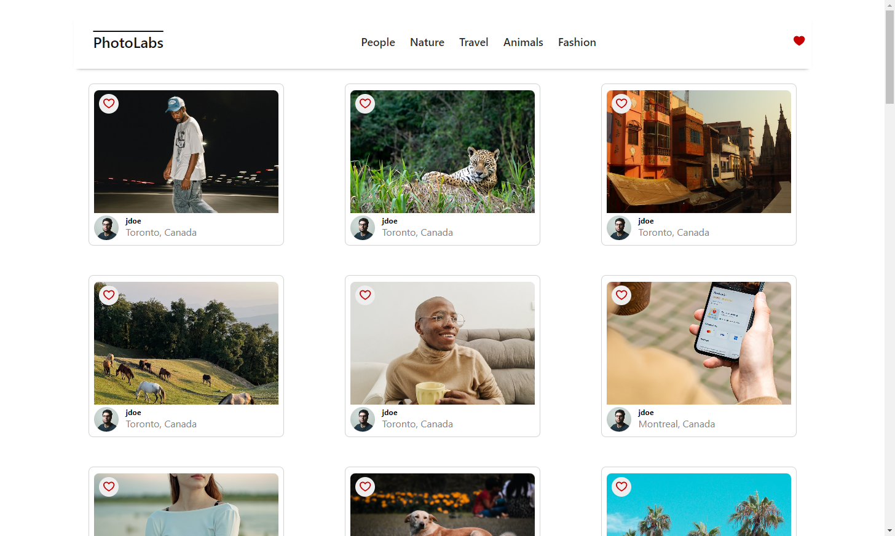
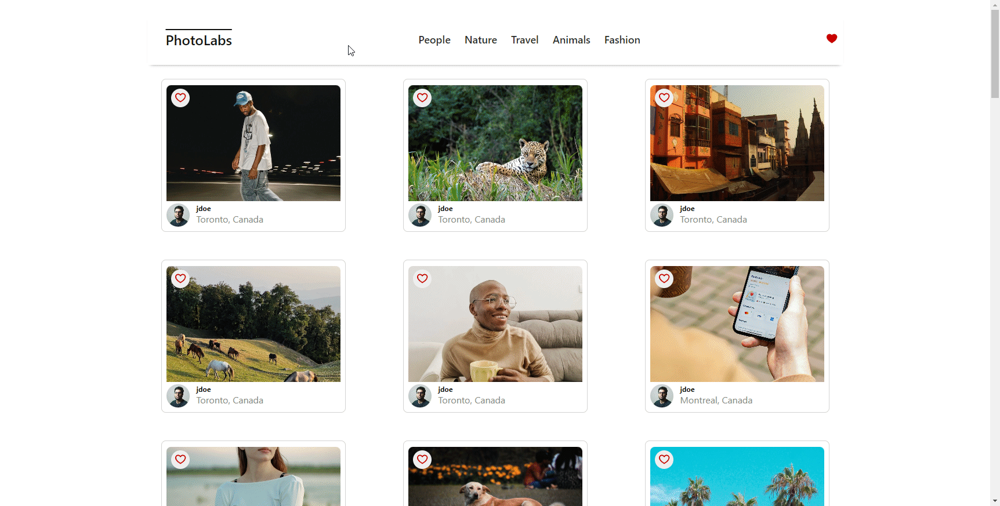

# 📸 react-photolabs
The PhotoLabs project for the Web Development React course programming.

# 🚀 Getting Started

## 🛠 Setup

Install dependencies with `npm install` in each respective `/frontend` and `/backend`.

## 🌐[Frontend] Running Webpack Development Server

```sh
cd frontend
npm start
```

## 🖥[Backend] Running Backend Servier

Read `backend/readme` for further setup details.

```sh
cd backend
npm start
```
## 🖼 Starting PhotoLabs
After following the startup instructions, the backend server should be up and running. The front end React server should then load in your browser at [http://localhost:3000/](http://localhost:3000/)

## 🎉 Dive into PhotoLabs
Once you're into PhotoLabs, you'll be greeted with a main screen flaunting all the awe-inspiring photos we've got! Scroll at leisure through the page to see the entire photo collection.


## 🔍 Up Close And Personal
Spotted a showstopper? 🕵️ Click to zoom and bask in its glory. Psst! We've got a bonus - recommendations on similar shots. Double wowie!


## ❤️ Your Fav Photos
That heart-skipping shot deserves a special place! 🌟 Favorite it from anywhere and bask in the instant gratification from the notification navbar!


## 🏷 Tons of Topics!
Drowning in visual awesomeness? Filter your feels by choosing from our eclectic array of topics. A curated experience, just for you!

