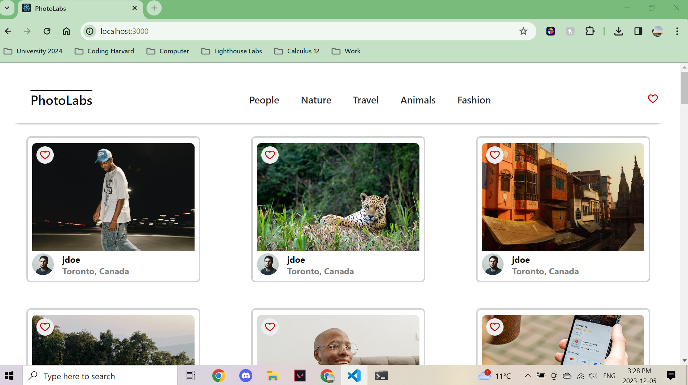
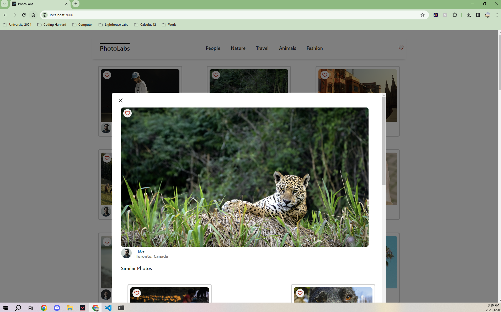

# react-photolabs
The PhotoLabs project for the Web Development React course programming.

# Photolabs

PhotoLabs is a single page React app that provided a practical environment for mastering React concepts and techniques. Working with components, state management, and React hooks helped me understand how to implement various features within the application. This project shows how I used modular design and facilitated a deeper understanding of how to create React applications.

## Behavioural Requirements

1. A user can view photos from the homepage loaded from the API.
2. The user can navigate to different photo categories, also called topics.
3. The user can click on a photo to view a larger version of the photo and relevant / similar   photos.
4. The user can like a photo from anywhere within the application where the photo is displayed.
5. The user can view a heart icon with a notification in the navigation if there are liked photos.
6. The navigation will consist of different topics and heart icon notifies if there are liked photos.

## Screenshots




## Setup

Install dependencies with `npm install` in each respective `/frontend` and `/backend`.

## [Frontend] Running Webpack Development Server

```sh
cd frontend
npm start
```

## [Backend] Running Backend Servier

Read `backend/readme` for further setup details.

```sh
cd backend
npm start
```
