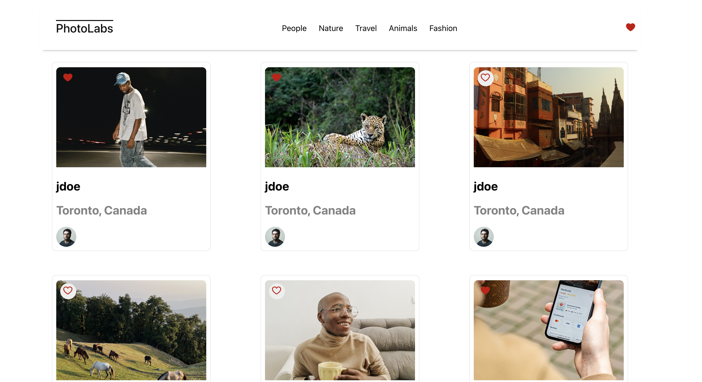

# react-photolabs
The PhotoLabs project for the Web Development React course programming.

# Photolabs

## Setup

Install dependencies with `npm install` in each respective `/frontend` and `/backend`.

## [Frontend] Running Webpack Development Server

```sh
cd frontend
npm start
```

## [Backend] Running Backend Servier

Read `backend/readme` for further setup details.

```sh
cd backend
npm start
```

## File structure

#### backend
     #### `src`
     #### `README FILE`

#### frontend
    #### `src`
        #### `components`
        #### `hooks`
        #### `routes`
        #### `app.jsx`
        #### `styles`

## PhotoLab's features

 * [**Display**] all photos from API.
 * [** Display**] all topics from API.
 * User can see [ **larger version**] of photo by clicking on it.
 * User can see [**Similar photos**] of the selected photo.
 * User can [**like**] a photo.
 * User can get [**notification**] in the shape of colored heart in the navigation bar by liking the photo.
 * User can see photos related to a [**particular topic**].


## Screen Shots from the projects




