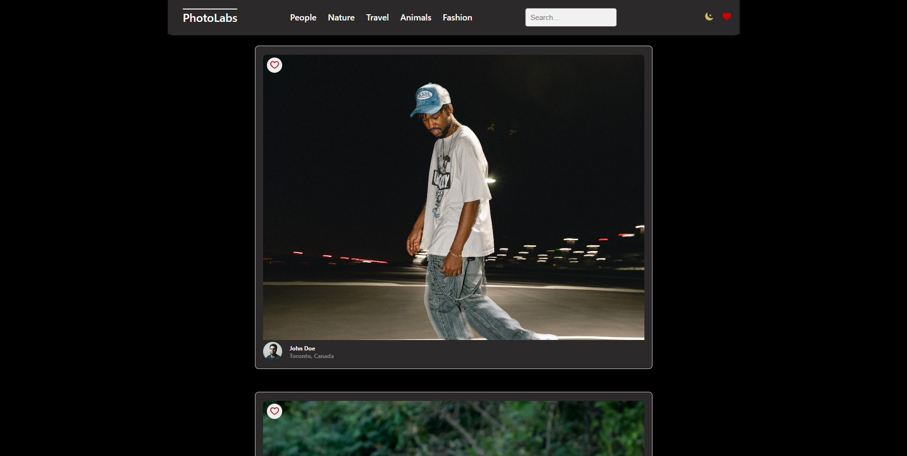
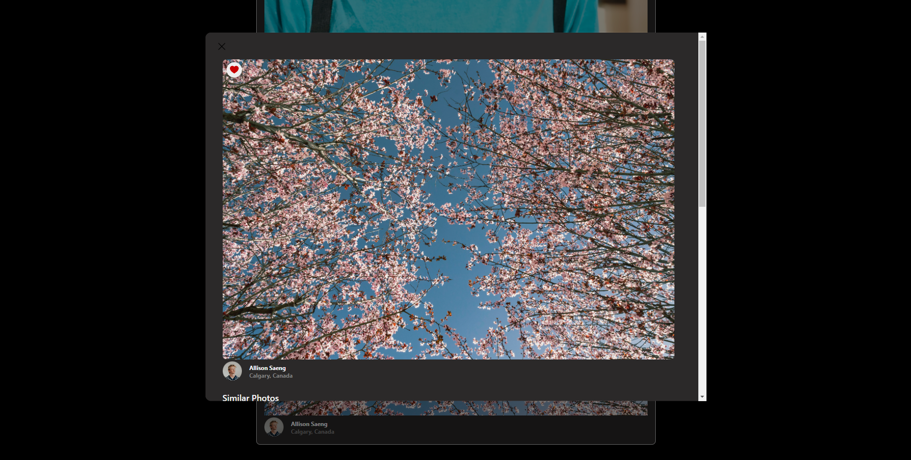
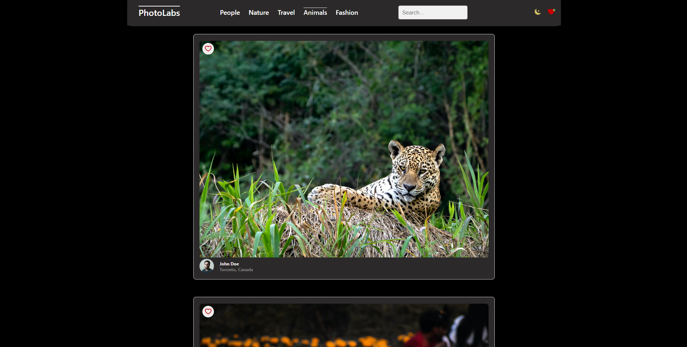

# Project Description
PhotoLabs is a single-page application created as part of the React course using a combination of Express and PostgreSQL for the back-end with React and Node.js for the front-end. This project simulates a user's experience using a photo-posting platform that allows for modal-viewing, favoriting, querying by search terms, sorting by photo category, and more.

# Technology Stack
- JavaScript
- React
- Express
- Node.js
- SCSS
- HTML
- SQL

# Screenshots




## Setup

Install dependencies with `npm install` in each respective `/frontend` and `/backend` folder.

## [Frontend] Running Webpack Development Server

```sh
cd frontend
npm start
```

## [Backend] Running Backend Servier

Read `backend/readme` for further setup details.

```sh
cd backend
npm start
```